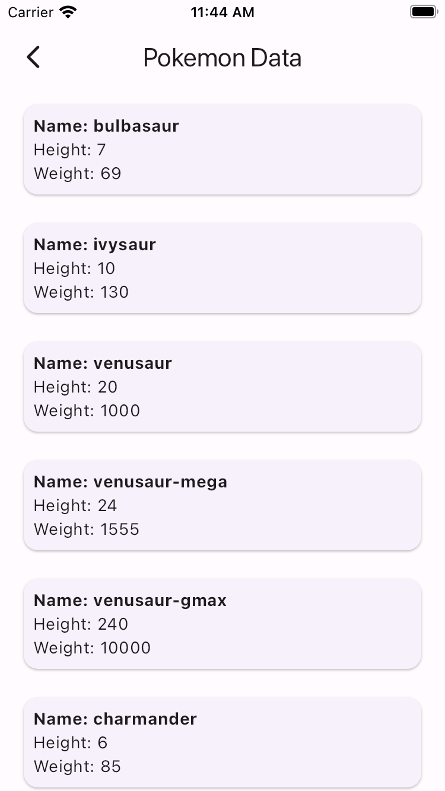

# GraphQL API Integration Practice App

This Flutter application serves as a practice platform for integrating GraphQL APIs. It allows users to explore various GraphQL APIs, query different entities, filter values, and learn about GraphQL implementation in Flutter.

## Features

- Integration with multiple GraphQL APIs.
- Fetching data for different entities such as characters, countries, Pokémon, films, etc.
- Filtering data based on specific criteria.
- Displaying fetched data in user-friendly UI components.
- Learning GraphQL implementation concepts in Flutter.

## Supported APIs

1. **AniList API**: Fetch anime-related data such as titles, descriptions, characters, etc.
2. **Pokémon API**: Retrieve information about Pokémon species, their attributes, and more.
3. **Rick and Morty API**: Explore characters from the famous TV show "Rick and Morty".
4. **Star Wars API**: Access information about Star Wars films, characters, and other related data.
5. **Countries API**: Retrieve details about countries including names, currencies, languages, etc.

## Screens

### 1. Dashboard Screen

- Navigate to different sections of the app.
- Each section corresponds to a specific GraphQL API.

### 2. AniList Screen

- Display anime titles, descriptions, characters, etc.
- Filter anime data based on user preferences.

### 3. Pokémon Screen

- Explore different Pokémon species, their attributes, and more.
- Filter Pokémon data based on specific criteria.

### 4. Rick and Morty Screen

- Browse characters from the "Rick and Morty" TV show.
- Filter characters based on various attributes.

### 5. Star Wars Screen

- Access information about Star Wars films, characters, etc.
- Filter Star Wars data according to user requirements.

### 6. Countries Screen

- View details about different countries including names, currencies, languages, etc.
- Filter countries based on specific criteria.

## Usage

1. Clone this repository to your local machine.
2. Run `flutter pub get` to install dependencies.
3. Run the app on an emulator or physical device using `flutter run`.

## What I Learned

- How to integrate GraphQL APIs into a Flutter app using packages like `graphql_flutter`.
- Constructing GraphQL queries to fetch specific data from APIs.
- Handling responses from GraphQL APIs and parsing them into Dart objects.
- Implementing filtering mechanisms to refine fetched data.
- Building user interfaces to display GraphQL data in a user-friendly manner.

## Screenshots

